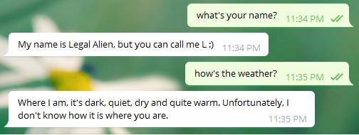
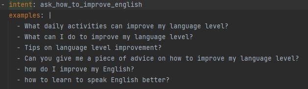
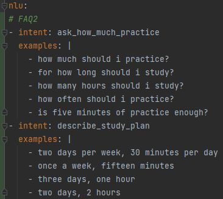
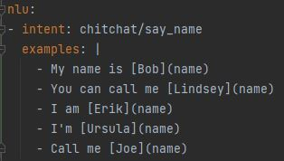
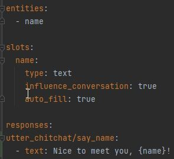
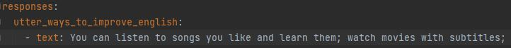
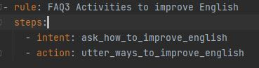
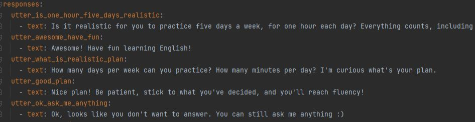
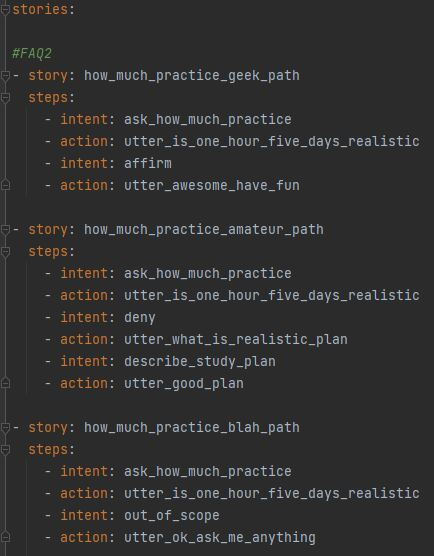
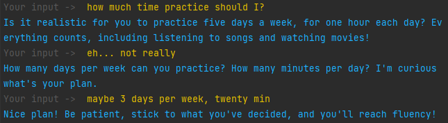

**LegalAlienChatbot**

Techies: Jeyana Morozenko, Violetta Shishkina, Nazlı Dolu 

Mentor: Matthijs Rijm

**Abstract**

With our project, we aim to build a chatbot to help people overcome foreign language anxiety. This is mainly the feeling of unease, worry, nervousness and apprehension experienced in learning or using a foreign language. We believe that before directly talking with a person, some written exercise with a human-like chatbot could ease the foreign language anxiety and increase the pace of language learning. For this purpose, we used a natural language understanding model. We created a chatbot using Rasa, an open source conversational AI platform.

**Introduction**

Research has shown that foreign language anxiety is an important issue in language learning throughout the world especially in terms of its strong relationship to the skill of speaking in a foreign or second language. This may have a significant effect on peoples' confidence and self-esteem causing individuals to be quieter and less willing to communicate.

One piece of advice that people with foreign language anxiety are given is to imagine how the discussion will likely go and think about what you want to say. Great! Prepare the required phrases and play out the scenario as if you were actually using them. Then we thought, why not do this with the help of technology?

Our goal was to build a chatbot that is fun to talk to. We believed that if the chatbot can imitate a person, users can improve themselves in personal communication until they feel confident enough to talk to a real person. To achieve this, we worked with Rasa which is an open source machine learning framework for automated text and voice-based conversations. It understands user messages and constructs conversations.

**Method**

In order to create a chatbot before the development of machine learning algorithms, one had to write a hard coded rule based program. This would require the programmer to think of every possible way that a user might say something so that it can map the correct response of the chatbot. There are two downsides of this method. One of them is the fact that it is not possible to think of every possible sentence a user might write. Another one is, even though we assume that the programmer “somehow” finds out the way of enumerating all the sentences, the user might make a typo and the algorithm won’t be able to understand this. To avoid these downsides and actually come up with what we expect our chatbot to do, we examined natural language programming (NLP) models. 

NLP is a subfield of artificial intelligence (AI) which concerns how to program computers to process large amounts of natural language data. However, the chatbot needs to understand what the user is saying and it also requires to decide what to say in response. Hence, it should also understand the context of data (what the user is saying). To achieve this, natural language understanding (NLU) takes the stage. NLU is a subfield of NLP. While NLP ensures the transformation of large amounts of unstructured natural language texts into structured data, NLU focuses on deriving insights from this structured data. The use of NLU allows chatbots to comprehend the context.

To utilize an NLU model, we used Rasa which is an open source machine learning framework for automated text.

The Rasa process works as follows: 

1.The user writes a message by using a messaging channel such as Telegram, Facebook Messenger, Slack etc.

2.This message is given as an input to the NLU model which transforms the message into a machine readable format. The NLU model makes a prediction to classify the meaning of the message (intent) and returns this output to the Dialogue Management model.

3.The Dialogue Management Model decides what the chatbot should do next (action).

4.Then Rasa open source chooses a response to give back to the user based on the set of responses.

Rasa is able to utilize different machine learning policies to decide which action to take. The ones we implemented are Rule Policy, The Transformer Embedding Dialogue (TED) Policy and Memoization Policy. Rule Policy is used for relatively simple cases in which the model needs to classify only one message of the user. On the other hand, TED and Memoization Policies are utilized for more complex cases. Parameters of these policies are defined in the config.yml file. For example, we changed the number of epochs for DIETClassifier and ResponseSelector from default 100 to 50, and in our case 50 epochs are enough for good results. With a reduced number of epochs, the models train faster. 

**Training the NLU Model**

NLU training data is formed of intents which are basically the categorization of the possible user messages, and entities. Intents consist of training examples that represent all of the different ways a user might express the intent. Here is an example of an intent and training examples. 

Here, the intent category “ask_how_to_improve_english” is generated to define possible different ways of how a user might ask “How to improve my English?”. All of the possible example questions are mainly the training examples. One significant advantage of Rasa is that since the policies we use are pretrained, we do not need to provide hundreds of example questions but five of them is sufficient for the training of the NLU model. Intents are defined in the nlu.md file.

These are other examples of intents we have generated. These are used more than once in the algorithms.

While these intents are only used for specific stories.

Also, Rasa entities and slots allow us to extract specific information from user messages. In nlu.yml, we specify how to extract entities. Check out the following example, the entity in this case is called "name".

Later in domain.yml, we define entities and slots, and write bot responses using slots. As you see, the entity and the slot have the same name. It makes it easier to fill the slot automatically. Rasa automatically stores entities into the slots of the same name.

We also need to specify possible responses that a chatbot can say to a user. These responses are hardcoded and can be found in the domain.yml file. As you can see, we created a response to the previously introduced intent “ask_how_to_improve_english” and this response is defined as “utter_ways_to_improve_english”.

If we continue on the same example of a user asking how to improve her English, we now have both the intent which helps chatbot to understand what the user is meaning to ask and its response to this question. It is time to show the chatbot that which intents and responses are correlated. To do so, we may create rules.

Hence, if a user asks a question about how to improve English, our chatbot will understand this intent and take the following action which is to say the sentence defined in “utter_ways_to_improve_english”. We have also created other responses for the “ask_how_to_improve_english” intent.

**Training the Dialogue Management Model**

We also need to train the dialogue management model. For this, the model requires rule or story data which are the combinations of both the intent behind what the user says and the chatbot response. This training is mainly to teach the model what to say/do depending on what the user said so far.

Then we come up with stories for chatbot to construct dialogue like conversations by using TED Policy. The stories are created in stories.md file. An example of how to create stories is as follows.

Different paths are defined for a conversation which starts by the user asking how much practice she should have. In all of the stories, at first the chatbot responds by asking whether one hour for five days would be realistic for the user (using the action: utter_is_one_hour_five_days_realistic). However the response of the user to this action may differ in real life and stories tried to capture these various patterns. In the first story, the user chooses to go with what the chatbot suggests and hence the chatbot encourages the user in responses. In the second story, apparently what the chatbot suggests is too much for the user, and so it asks for an alternative plan. In the third story, the user says something irrelevant, and the chatbot is not insisting on answering the practice plan question but rather suggesting to talk about something else.

For all these input data for the training model, we used Grammarly to correct our English for the chatbot’s responses since none of us is a native English speaker.

In the end we had the following conversation with our chatbot:

As you can see, even though the sentences of the user are not grammatically correct, the chatbot correctly identifies the intent and gives a proper response.

Our github repo can be found in the following link: https://github.com/Jeyana/LegalAlienChatbotRasa

**Advantages of Rasa**

-The computational time of training is faster than simple benchmark chatbots.

-Eventhough user makes a typo while writing a question, the model is able to understand the intent of the user.

-Having two separate models (NLU and Dialogue Management Model) is beneficial for practical purposes. For instance, if you make a change in one of these models, you only need to retrain the model you make a change to, this saves time and computation power.

-The fact that it is an open source project gives the programmer high flexibility.

-And it is entirely written in Python! (also integrated with Python 3.8)

-Training data is written in markdown files which is also easy for programmers to read and write.

**Disadvantages of Rasa**

-Not that practical for debugging and collaboration.

-The model can only learn from the input of the user, the responses of the chatbot are hardcoded.

**Conclusion**

Rasa might be one of the best FREE conversational AI platforms out there, and we had a lot of fun creating this project together. Still, we wouldn't recommend Rasa for teams with more than one programmer, or for large and complex chatbots.

